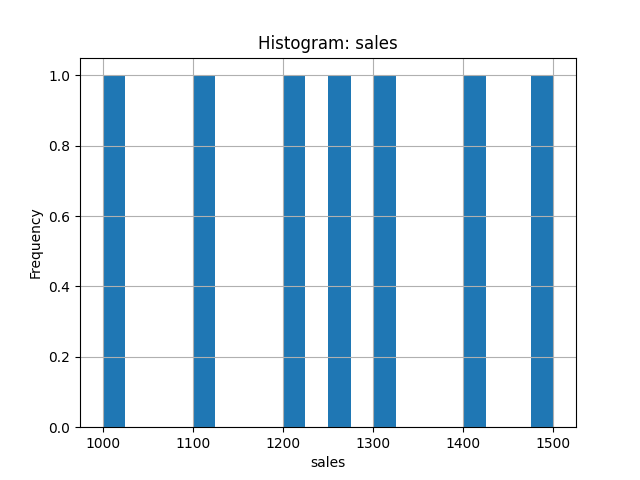
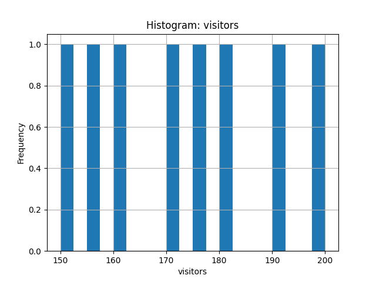

# Simple Data Analyzer

A beginner-friendly Python project that analyzes CSV data, displays key statistics, and identifies missing values.

## Features
- Reads and analyzes CSV files  
- Displays data preview, mean, median, std, and other stats  
- Detects missing values  
- Built using Python and pandas  

## How to Run
1. Install dependencies  
   ```bash
   pip install pandas
---

## 📊 Example Output

After running the analyzer with `python3 data_analyzer.py sample_data.csv --save summary.csv --plot sales,visitors --saveplot`, the following outputs are generated:

### Mean Plot
This chart shows the average values of all numeric columns.


### Histograms
Here are the distributions for each numeric column analyzed:



---

✅ The project automatically:
- Generates summary statistics (`summary.csv`)
- Saves visualizations (`plot_means.png`, `sales_hist.png`, `visitors_hist.png`)
- Can easily be extended to analyze new datasets
